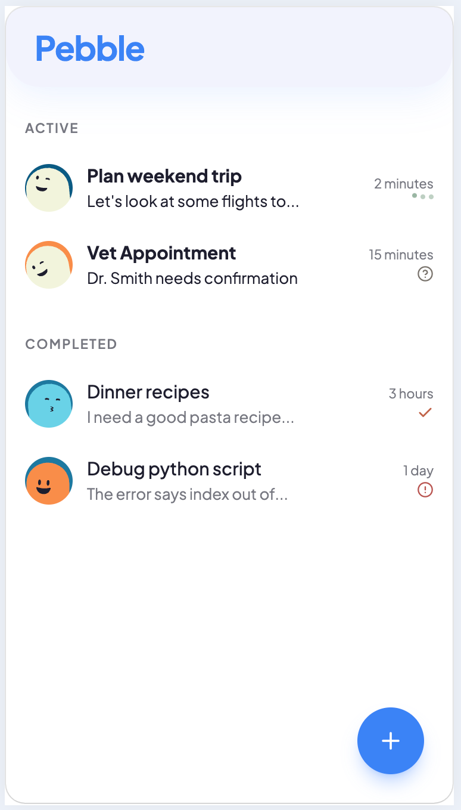

<p align="center">
  
</p>

<h1 align="center">Pebble</h1>
<p align="center">A warm, minimal PWA chat interface for AI agents.</p>

---

**Pebble** is a static web app that connects directly to your agent over HTTP. No backend, no accounts, no special software — just open a URL and start chatting.

Your conversations stay organized like WhatsApp: sessions sorted by recency, status icons, unread counts. Your agent can push interactive UI blocks (buttons, forms, charts) directly into the thread.

Installs to your home screen. Works on desktop and mobile.

> **Heads up:** Pebble talks to [Hermes](https://github.com/nousresearch/hermes-agent) agents only, for now. Support for other hosts is on the roadmap — see [Other Hosts](#other-hosts) below.



## Quick Start (Hermes)

**Fastest path:**

```bash
./start.sh
```

That script installs deps, verifies your API server is configured, and prints your launch URL.

**Manual:**

```bash
npm install
npm run dev

# Get your launch URL
API_KEY=$(grep '^API_SERVER_KEY=' ~/.hermes/.env | cut -d'=' -f2)
echo "http://localhost:5173/?hermes=http://localhost:8642&token=$API_KEY"
```

Open that URL in your browser. Done.

### First-time Hermes setup

If the API server isn't enabled yet (you'll see connection errors), add to `~/.hermes/.env`:

```bash
API_SERVER_ENABLED=true
API_SERVER_KEY=$(openssl rand -hex 16)
```

Then restart:

```bash
hermes gateway restart
```

## For Agents

If you're a Hermes agent installing Pebble, start with **[AGENT.md](./AGENT.md)** — it has the install flow (binary + plugin + gateway restart), troubleshooting, and the `pebble_send` communication protocol.

## For Developers

- **[CLAUDE.md](./CLAUDE.md)** — product context, design system, component rules, project structure
- **[TODO.md](./TODO.md)** — build order and task backlog
- **[SPEC.md](./SPEC.md)** — original product spec (ignore MCP/tunnel transport references — those are outdated)
- **[hermes-plugin/skills/pebble-protocol/SKILL.md](./hermes-plugin/skills/pebble-protocol/SKILL.md)** — the `pebble_send` protocol and json-render component catalogue

## Stack

| | |
|---|---|
| Framework | React + Vite |
| Styling | Tailwind CSS v4 |
| Components | shadcn/ui |
| Generative UI | @json-render/react |
| State | Zustand |
| Transport | Hermes HTTP API (SSE streaming) |
| Persistence | localStorage + IndexedDB |

## Other Hosts

Today, Pebble speaks to Hermes and nothing else. The transport lives behind a small adapter layer ([`src/lib/adapters/`](./src/lib/adapters/)), so other hosts — OpenClaw, Claude Code, anything with a streaming HTTP API — are a natural next step rather than a rewrite. They're on the roadmap.

In the meantime, if you're running another platform, you can point Pebble at it by exposing a Hermes-compatible HTTP API.

## License

MIT
